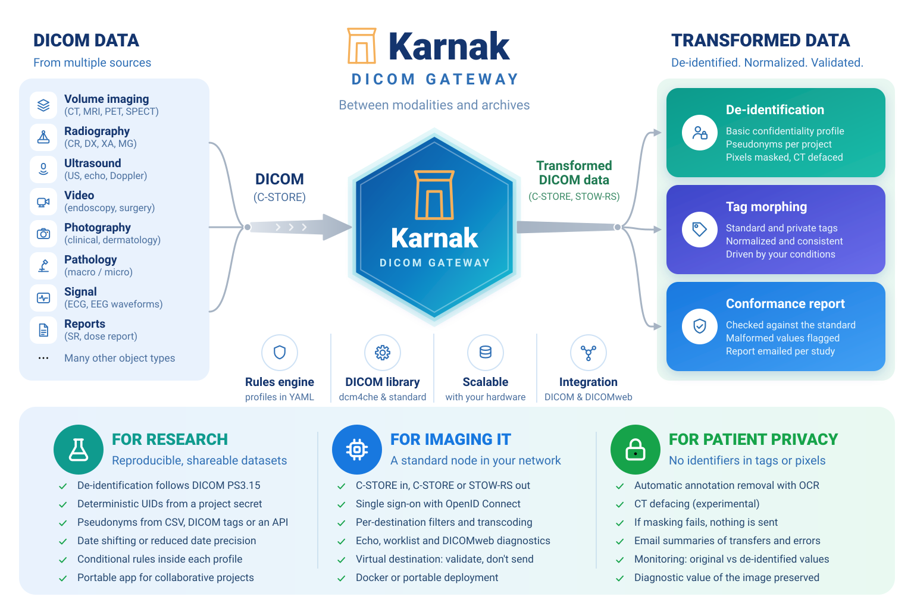
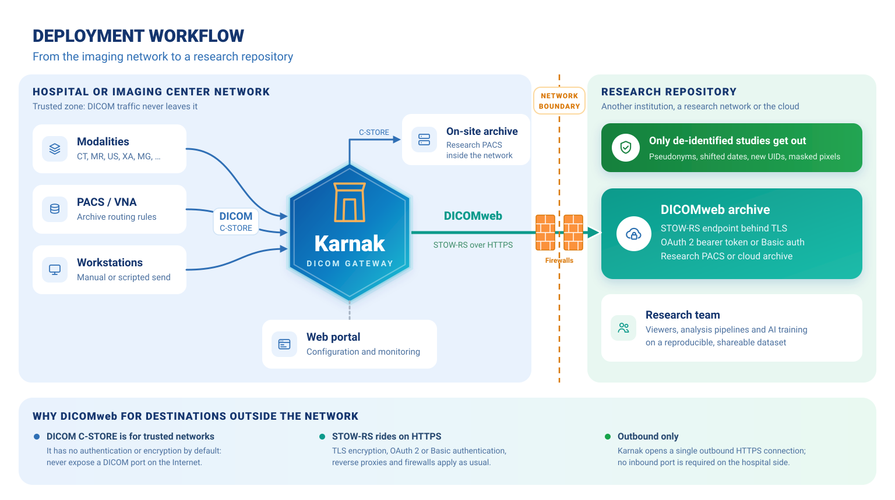

[](https://opensource.org/licenses/EPL-2.0) [](https://opensource.org/licenses/Apache-2.0)  

[](https://sonarcloud.io/component_measures?id=nroduit_karnak) [](https://sonarcloud.io/component_measures?id=nroduit_karnak&metric=coverage) [](https://sonarcloud.io/component_measures?id=nroduit_karnak) [](https://sonarcloud.io/component_measures?id=nroduit_karnak) [](https://sonarcloud.io/component_measures?id=nroduit_karnak) [](https://sonarcloud.io/dashboard?id=nroduit_karnak)

**Karnak** is an open-source DICOM gateway for **de-identification**, **tag morphing** and **DICOM conformance checks**. It sits between the imaging network and the archives: it receives studies from modalities, PACS and workstations through a DICOM listener, transforms them according to configurable YAML profiles, and forwards the result to one or more destinations over DICOM (C-STORE) or DICOMweb (STOW-RS). Everything is configured and monitored from a web portal.



For detailed usage instructions, refer to the [Karnak User Guide](https://weasis.org/karnak-documentation/).

# How it works

## Deployment workflow

A typical deployment feeds a research repository that lives **outside** the hospital or imaging center: another institution, a research network or the cloud.



- **Inside the network**, the DICOM protocol is used as usual: modalities, the PACS or a workstation send studies to a Karnak *forward node* (an AE Title on the DICOM listener) with C-STORE. Karnak can authenticate the callers by AE Title and hostname.
- **Across the network boundary**, Karnak sends the de-identified studies to the repository with **DICOMweb STOW-RS over HTTPS**. This is the recommended protocol for any destination outside the trusted network: the transfer is encrypted with TLS, authenticated with an OAuth 2 bearer token or Basic auth, and only needs one outbound HTTPS connection, so no DICOM port is ever exposed to the Internet.
- An on-site archive (a research PACS in the same network) can still be reached with plain C-STORE, and both kinds of destinations can be combined on the same forward node.

## Processing pipeline

The forward node addressed by the called AE Title checks the calling source, then routes each accepted instance to one or more destinations, where it goes through the following pipeline once per destination. Every step is configured on the [destination](https://weasis.org/karnak-documentation/en/userguide/gateway/destinations/).

```mermaid
%%{init: {"theme": "base", "themeVariables": {"fontSize": "15px", "textColor": "#0b1f3f", "primaryTextColor": "#0b1f3f", "lineColor": "#334155", "edgeLabelBackground": "#ffffff", "labelTextColor": "#0b1f3f", "clusterBkg": "#f4f8fd", "clusterBorder": "#2f6fb5", "titleColor": "#0b1f3f"}}}%%
flowchart LR
    src["Modality, PACS<br>or workstation"]:::ext
    src -->|"<b>DICOM C-STORE</b>"| fwd

    subgraph karnak["Karnak gateway"]
        direction LR
        fwd["Forward node<br><i>DICOM listener, AE Title</i><br>routes to one or more destinations"]:::karnak
        auth{"Source<br>authorized?"}:::karnak
        reject["Instance refused<br>not authorized"]:::stop
        fwd --> auth
        auth -->|"<b>no</b>"| reject
        subgraph dest["For each destination of the forward node"]
            direction LR
            filter["Conditions and<br>SOP class filter"]:::step
            skip["Instance<br>skipped"]:::stop
            profile["Profile<br>de-identification<br>or tag morphing"]:::step
            pixels["Pixel cleaning<br>masks, OCR, defacing"]:::step
            ts["Transfer syntax<br>adaptation"]:::step
            project[("Project secret<br>Pseudonyms from cache,<br>DICOM tag or API")]:::data
            filter -.->|"<b>no match</b>"| skip
            filter --> profile --> pixels --> ts
            project -.-> profile
        end
        auth ==>|"<b>yes</b>"| filter
    end

    ts -->|"<b>DICOM C-STORE</b>"| pacs["On-site PACS<br>or archive"]:::dicom
    ts -->|"<b>STOW-RS over HTTPS</b>"| web["DICOMweb repository<br>outside the network"]:::web
    ts -.-> report["Monitoring, notifications,<br>conformance report"]:::ext

    classDef ext fill:#334155,stroke:#1e293b,stroke-width:1.5px,color:#ffffff,font-weight:bold;
    classDef karnak fill:#0b4a8f,stroke:#062f5e,stroke-width:1.5px,color:#ffffff,font-weight:bold;
    classDef step fill:#2f6fb5,stroke:#1d4f8f,stroke-width:1.5px,color:#ffffff,font-weight:bold;
    classDef data fill:#4c3fb5,stroke:#332a80,stroke-width:1.5px,color:#ffffff,font-weight:bold;
    classDef stop fill:#b91c1c,stroke:#7f1d1d,stroke-width:1.5px,color:#ffffff,font-weight:bold;
    classDef dicom fill:#1d4f8f,stroke:#0b1f3f,stroke-width:1.5px,color:#ffffff,font-weight:bold;
    classDef web fill:#0b7a6e,stroke:#064e46,stroke-width:1.5px,color:#ffffff,font-weight:bold;
    style karnak fill:#e3edf9,stroke:#1d4f8f,stroke-width:1.5px,color:#0b1f3f
    style dest fill:#ffe9b8,stroke:#d9932e,stroke-width:1.5px,color:#0b1f3f
    linkStyle 0,9 stroke:#1d4f8f,stroke-width:2.5px
    linkStyle 10 stroke:#0b7a6e,stroke-width:2.5px
    linkStyle 2,3 stroke:#b91c1c,stroke-width:2px
    linkStyle 11 stroke:#1e293b,stroke-width:2.5px
    linkStyle 7 stroke:#4c3fb5,stroke-width:2.5px
    linkStyle 1,8 stroke:#0b4a8f,stroke-width:3px
```



1. **Source check**: if the forward node declares [sources](https://weasis.org/karnak-documentation/en/userguide/gateway/sources/), only those AE Titles (and optionally hostnames) are accepted; any other caller gets the DICOM status *Not authorized* and nothing is forwarded.
2. **Filtering**: a destination can restrict the forwarded SOP Classes and evaluate an [expression on the DICOM attributes](https://weasis.org/karnak-documentation/en/profiles/conditions/); instances that do not match are skipped for that destination only.
3. **Profile**: the destination applies either a [de-identification profile](https://weasis.org/karnak-documentation/en/profiles/) (DICOM PS3.15 basic profile, tag actions, date shifting, UID re-mapping, pseudonymization driven by the project secret) or a tag-morphing profile that normalizes attributes without de-identifying.
4. **Pixel cleaning**: burned-in annotations are masked with hand-defined areas or automatically with the [OCR service](https://weasis.org/karnak-documentation/en/profiles/masks/), and head CT studies can be defaced.
5. **Transfer syntax**: the image is transcoded when the destination requires another transfer syntax.
6. **Send and report**: the instance is sent with C-STORE or STOW-RS; the transfer is tracked in [Monitoring](https://weasis.org/karnak-documentation/en/userguide/monitoring/), summarized in email notifications and optionally validated in a [DICOM conformance report](https://weasis.org/karnak-documentation/en/userguide/conformancereport/).

# Features

## Gateway

- Fan out from a single source to multiple destinations.
- A destination can be DICOM (C-STORE) or DICOMWeb (STOW-RS).
- Authenticate sources by AE Title and/or hostname to ensure their authenticity.
- Filter by SOP Class UID to forward only specific SOP Classes.
- Use expressions on DICOM tag values to filter which images are forwarded.
- On-the-fly transfer-syntax adaptation (transcoding) per destination.

## De-identification

- Each destination can be configured with a specific de-identification profile.
- Profiles are ordered pipelines of items: basic profile, tag actions (keep, remove,
  replace, hash), date shifting, UID re-mapping, add/replace tags, and API-based value replacement.
- Pixel-data cleaning: mask burned-in annotations and deface (remove facial features from head studies).
- Deterministic pseudonymization (HMAC-based), so the same patient always maps to the same pseudonym.
- [Build your own de-identification profile](https://weasis.org/karnak-documentation/en/profiles),
  edit it directly as YAML in the UI, and import/export profiles to share them with other users.

## Pseudonym mapping (External ID)

- Supply your own patient-to-pseudonym mapping instead of the generated one, entered in the UI or
  imported from a CSV file.
- Mappings are held in a cache (Redis, or an in-memory cache in the portable build).

## Projects

- Group destinations under a project that carries the secret used for pseudonymization.
- Secrets are stored encrypted at the database layer.

## Monitoring

- Follow transfers in a destination, study and series tree, compare original and de-identified
  values, and export the activity as CSV.
- Optional email notifications per destination and per-study DICOM conformance reports.

## DICOM tools

- Built-in tools to test and probe DICOM nodes and DICOMweb endpoints: C-ECHO (with a persisted
  check history), Modality Worklist (MWL) queries and DICOMweb capability checks.

# Getting started

You don't need to build Karnak from source to use it. Pick the option that fits your needs:

| I want to… | Use | Details |
|------------|-----|---------|
| Run Karnak in production | **Docker** | [Installation guide](https://weasis.org/karnak-documentation/en/installation/) — Docker Compose with Postgres + Redis, the recommended setup |
| Try Karnak quickly on a single machine | **Portable package** | Self-contained, embedded database, no external services — see [Run portable package](#run-portable-package) |
| Contribute to / develop Karnak | **Build from source** | See [Build Karnak](#build-karnak) and [Debug Karnak](#debug-karnak) |

## Accessing Karnak

Once Karnak is running, with the default configuration:

- **Web interface**: <http://localhost:8080> with the docker image, <http://localhost:8081> with the portable package or when running from the IDE
- **Default credentials**: user `admin`, password `karnak` (change these in production: `KARNAK_LOGIN_ADMIN` / `KARNAK_LOGIN_PASSWORD_FILE` with docker, `KARNAK_ADMIN` / `KARNAK_PASSWORD` otherwise)
- **DICOM listener**: AE Title `KARNAK-GATEWAY`, port `11119` (the portable package uses `11112`) — point your modality or PACS here to send studies to Karnak

The web port (`KARNAK_WEB_PORT`), the listener AE Title (`DICOM_LISTENER_AET`) and port (`DICOM_LISTENER_PORT`), as well as the sources and destinations, are all configurable; see the [Karnak User Guide](https://weasis.org/karnak-documentation/).

# Build Karnak

Prerequisites:
- JDK 25
- Maven 3.3+

## Build for docker image

Execute the maven command `mvn clean install -P production` in the root directory of the project. The "production" profile builds the Vaadin frontend via pnpm and produces a deployable jar.

## Build for portable package

Execute the maven command `mvn clean install -Pportable` in the root directory of the project.

Note: on Windows the bash.exe must be specified: `mvn clean install -Pportable -Dbash.executable=${env.LOCALAPPDATA}\Programs\Git\bin\bash.exe`

# Run Karnak

## Run with docker
To configure and run Karnak with docker compose (Karnak + Postgres + Redis), follow the [installation guide](https://weasis.org/karnak-documentation/en/installation/). This is the recommended setup for production.

## Run portable package
After building the portable package (see [Build for portable package](#build-for-portable-package)), go into the generated folder `build-portable/target/karnak-<os>-jdk<version>-<karnak-version>` (for example `karnak-linux-x86-64-jdk25-...`) and launch `run.bat` (Windows) or `./run.sh` from a terminal (Linux or macOS). On macOS there is no double-clickable launcher: Gatekeeper refuses to open a script downloaded from the Internet, so open a Terminal in the folder and run `./run.sh`.

Settings such as the web port and the DICOM listener can be adjusted in the `run.cfg` file located next to the executable. On the first launch the script proposes to download the optional OCR service used by the automatic pixel de-identification (release pinned by `OCR_VERSION` in `run.cfg`), then opens the web portal in the default browser (`KARNAK_OPEN_BROWSER=false` disables this).

Then open <http://localhost:8081> and log in (see [Accessing Karnak](#accessing-karnak)).

Note: this portable package runs an embedded database (H2) in file mode, and the Redis server is replaced by an in-memory cache. For intensive use, it's recommended to run Karnak with docker and a Postgres database.

# Debug Karnak

## Debug in IntelliJ

- Launch the components needed by Karnak (see below "Run locally the database and the cache with docker")
- Run `mvn clean install` once before the first debug session. Besides building the project, this copies
  the native OpenCV library into `target/classes/lib/<os>-<cpu>/` — it is loaded at startup by the DICOM
  gateway, and the application fails with "Cannot register DICOM native librairies" if it is missing.
- Enable Spring and Spring Boot for the project
- Create a Spring Boot launcher from the main of `KarnakApplication.java`
    - Working Directory must be the project root directory (the folder containing `pom.xml`)
    - In VM Options:
      - Add `-Djava.library.path="/tmp/dicom-opencv"`. Note: the tmp folder must be adapted according to your system and `dicom-opencv` is mandatory as the last folder.
      - Optional: Add `-Dvaadin.productionMode=true` to enable production mode
    - In Environment variables, add the following values. The following values work with our default
      configuration defined with docker used for the development (see: "Run locally the database and the cache with docker") :
        - Mandatory:
            - `DB_ENCRYPTION_KEY=fsGuSZRIEr$HwlTDPglZg*Vl7WtJCZz6RLvqoMKWSA!`
        - Optional:
            - `DB_PASSWORD=karnak`
            - `DB_PORT=5433`
            - `DB_USER=karnak`
            - `DB_NAME=karnak`
            - `DB_HOST=localhost`
            - `KARNAK_ADMIN=admin`
            - `KARNAK_PASSWORD=karnak`
            - `IDP=undefined`
            - `OIDC_CLIENT_ID=undefined`
            - `OIDC_CLIENT_SECRET=undefined`
            - `OIDC_ISSUER_URI=undefined`

## Debug the portable package in IntelliJ

The portable build has no external dependencies: it runs an embedded H2 database (file mode) and an
in-memory cache instead of Postgres + Redis. To debug it in IntelliJ you don't need the docker
components — you only need to activate the `portable` Spring profile and, optionally, configure a
local DICOM node so received studies are written to disk.

Reuse the Spring Boot launcher from [Debug in IntelliJ](#debug-in-intellij) with the same VM options
(`-Djava.library.path=...`), then in Environment variables:

- Activate the portable profile (it swaps in `application-portable.yml`). Either set it in the
  launcher's **Active profiles** field (`portable`), or add the environment variable:
    - `SPRING_PROFILES_ACTIVE=portable`
- Optional — persist incoming studies to a local folder. When `LOCAL_NODE_PORT` and
  `LOCAL_NODE_STORAGE_PATH` are both set, Karnak starts an additional DICOM listener that stores
  received objects on disk:
    - `LOCAL_NODE_STORAGE_PATH=./dicom`
    - `LOCAL_NODE_AE_TITLE=KARNAK-LOCAL`
    - `LOCAL_NODE_PORT=11115`
    - `LOCAL_NODE_FILEPATH_PATTERN={00100010}/{00080060}/{0020000E}/{00080018}.dcm`

The H2 database file is created under `./data` in the working directory, so no docker services are
required. Then open <http://localhost:8081> and log in (see [Accessing Karnak](#accessing-karnak)).

## Run locally the database and the cache with docker

- Go in the `docker` folder located in the root project folder.
- To configure third-party components used by karnak, please refer to these links:
    - [docker hub postgres](https://hub.docker.com/_/postgres)
- Adapt the values if necessary (copy `.env.example` into `.env` and modify it)
- Execute command:
    - start: `docker compose up -d`
    - show the logs: `docker compose logs -f`
    - stop: `docker compose down`

# Code formatting

Two formatting plugins are bound to the Maven build and run automatically during `mvn install`:

- **[spring-javaformat](https://github.com/spring-io/spring-javaformat)** — applies the Spring Java
  code style (indentation, spacing, line wrapping). It does not modify imports.
- **[spotless](https://github.com/diffplug/spotless)** — removes unused imports, sorts them
  (static imports first, then a blank line, then the rest) and enforces the EPL-2.0 OR Apache-2.0
  license header on every Java file. It neither rejects nor expands wildcard imports
  (`import x.y.*;`) — it leaves them untouched.

CI and Sonar flag any style violation, so make sure your changes are formatted before pushing. You
can apply both formatters locally with:

```bash
mvn spring-javaformat:apply spotless:apply
```

## IntelliJ setup

Neither plugin **expands** an existing wildcard import into explicit single-class imports. Configure
IntelliJ so it never produces wildcards in the first place:

- **Settings → Editor → Code Style → Java → Imports**:
    - *Class count to use import with '\*'*: `999`
    - *Names count to use static import with '\*'*: `999`
    - *Packages to Use Import with '\*'*: remove every entry
- Run **Code → Optimize Imports** (⌃⌥O) to expand existing wildcards and drop unused imports. The
  file must compile for IntelliJ to resolve the types.
- Optional: enable **Settings → Tools → Actions on Save → Optimize imports** to keep imports clean
  automatically, matching what spotless and spring-javaformat expect.

# Docker

Minimum docker version: **20.10**

## Build with Dockerfile

Go on the root folder and launch the following command:

* Full independent build: `docker build -t local/karnak:latest -f Dockerfile .`
* Build from compile package:
    * `mvn clean install -P production`
    * `docker build -t local/karnak:latest -f src/main/docker/Dockerfile .`

## Run image from Docker Hub

The image is published as [`nroduit/karnak`](https://hub.docker.com/r/nroduit/karnak) (`linux/amd64` and `linux/arm64`). The container listens on port `8080` for the web portal (`KARNAK_WEB_PORT` changes it) and `11119` for the DICOM listener. See the [installation guide](https://weasis.org/karnak-documentation/en/installation/) for a complete docker compose setup.

## Docker environment variables

See the [environment variables](https://weasis.org/karnak-documentation/en/installation/#environment-variables) section of the installation guide.

# Architecture

This project is divided in two parts:

- backend: spring data (entities, repositories, converters, validators), enums, 
        spring configurations, spring security, cache, spring services, models...
- frontend : Vaadin components:  logic services, graphic components, views

# Identity provider

An OpenID Connect identity provider can be configured by using the environment variables:
 - `IDP`:  when this environment variable has the value 'oidc', the following environment 
 variables will configure the OpenID Connect identity provider. Any other value will load the in 
 memory user configuration. 
 - `OIDC_CLIENT_ID`: client id of the identity provider 
 - `OIDC_CLIENT_SECRET`: client secret of the identity provider
 - `OIDC_ISSUER_URI`: issuer URI of the identity provider
 
# API / Endpoints

Karnak exposes a small REST API in addition to the web interface. An OpenAPI (Swagger) description is generated by springdoc and the C-ECHO endpoint is available at `/api/echo`. For the full list of endpoints and their usage, refer to the [Karnak User Guide](https://weasis.org/karnak-documentation/).
